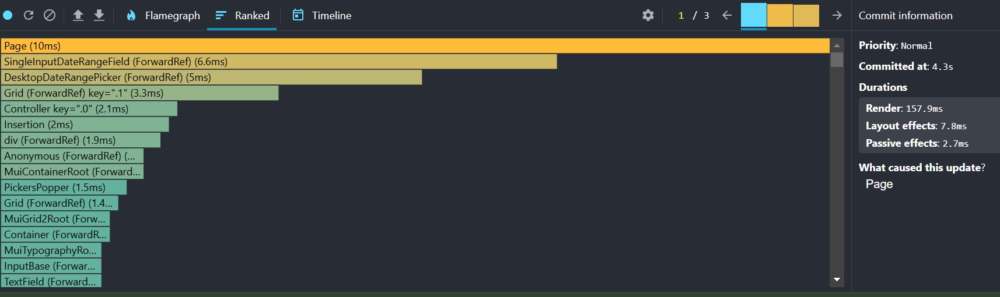
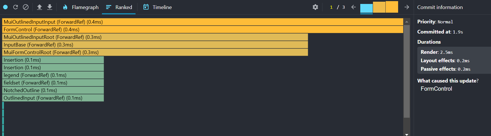
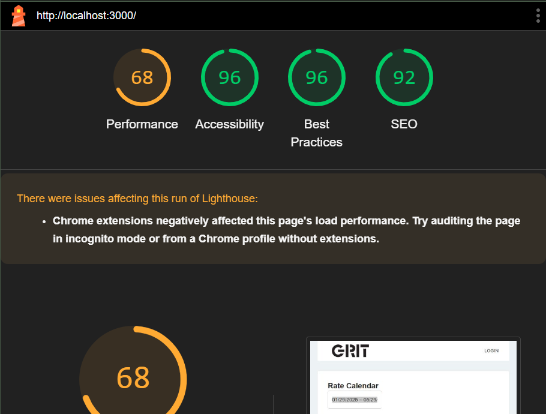

# Project Documentation

This project implements an optimized **infinite scrolling calendar** using **React Query’s `useInfiniteQuery`** and **React Window** for virtualization. It efficiently fetches and displays room rate availability data while ensuring smooth scrolling behavior.  

---

## 🚀 Features Implemented  

✅ **Infinite Scrolling**  
- Uses `useInfiniteQuery` with a `cursor` parameter to fetch paginated data dynamically.  
- Fetches new data as the user scrolls down.  

✅ **Optimized Scroll Behavior**  
- Throttles scroll events using `lodash/throttle` to prevent excessive API calls. 
- Uses `requestAnimationFrame` for smooth rendering. 

✅ **Performance Improvements**  
- Uses `staleTime` to reduce unnecessary re-fetching. 

---

### </> Implemented Code

✅ **Infinite Scrolling Implementation**  
- The infinite scrolling functionality is implemented using React Query’s useInfiniteQuery in useRoomRateAvailabilityCalendar.ts.

🔹 Key Changes in useRoomRateAvailabilityCalendar.ts

```json

// Custom hook to fetch room rate availability calendar data
export default function useRoomRateAvailabilityCalendar(params: IParams) {

  const fetchData = async ({pageParam = 0}) => {
    // Construct the URL with query parameters
  const url = new URL(
    `${process.env.NEXT_PUBLIC_BACKEND_URL}/api/v1/property/${params.property_id}/rate-calendar/assessment`
  );

    url.search = new URLSearchParams({
      start_date: params.start_date,
      end_date: params.end_date,
      cursor: pageParam.toString(), // for infinite scroll
      fields: "id,name,rate", // Fetch only necessary fields
    }).toString();

    return await Fetch<IResponse>({
      method: "GET",
      url, // Fetch data from the API
    })
  }

  // Use React Query's useInfiniteQuery hook to fetch data
  return useInfiniteQuery({
    queryKey: ["property_room_calendar", params], // Unique query key
    queryFn: fetchData,
    initialPageParam: 0,
    getNextPageParam: (lastpage) => {
      // Check if there is a next cursor to get next page data
      if(lastpage.data.nextCursor){
        return lastpage.data.nextCursor ?? undefined
    },
    staleTime: 2 * 60 * 1000, // Keep data fresh for 2 minutes
  });
}

```

**How it works?**

🔹 The API is called with a cursor parameter to fetch the next page of data.

🔹 getNextPageParam ensures pagination continues until no more data is available.

🔹 StaleTime prevent unnecessary re-fetching.

✅ **Change the Scroll Trigger Point**

- By default, data loads when reaching the bottom. Adjust the threshold in useInView to fetch earlier.

🔹 Added in page.tsx

```json

  const { ref: loadMoreRef, inView } = useInView({
  threshold: 1, // Fetch when user scrolls 100% into the last item
});

```

**Why using?**

🔹 Checks if scrolls down at bottom in a given ratio to call for fetching more data


✅ **Optimized Scroll Behavior**

- Used lodash/throttle to limit scroll event calls.
- Used requestAnimationFrame for smooth rendering.

🔹 lodash/throttle in page.tsx

```json

  const handleFetchMore = useCallback(
    throttle(() => {
      // if there is next page then fetch the next page
      if (room_calendar.hasNextPage) {
        room_calendar.fetchNextPage();
      }
    }, 500), // Runs at most every 500ms
    [room_calendar.hasNextPage, room_calendar.fetchNextPage]
  );

```

🔹 requestAnimationFrame in page.tsx

```json

const handleDatesScroll = useCallback((params: GridOnScrollProps) => {
    requestAnimationFrame(() => {
      InventoryRefs.current.forEach((ref) => {
        if (ref.current) {
          ref.current.scrollTo({ scrollLeft: params.scrollLeft });
        }
      });
    });
  
    if (calenderMonthsRef.current) {
      calenderMonthsRef.current.scrollTo(params.scrollLeft);
    }
  }, [InventoryRefs]);

  useEffect(() => {
    const container = mainGridContainerRef.current; // Store ref in a variable

    const onScroll = () => {
      if (container) {
        handleDatesScroll({
          scrollLeft: container.scrollLeft || 0,
          scrollTop: 0, // Default value since it's not used
          horizontalScrollDirection: "forward", // Arbitrary value
          verticalScrollDirection: "forward", // Arbitrary value
          scrollUpdateWasRequested: false, // Assumes scroll is user-triggered
        });
      }
    };
    
  
    if (container) {
      container.addEventListener("scroll", onScroll);
    }
    
    return () => {
      container?.removeEventListener("scroll", onScroll);
    };
  }, [handleDatesScroll]);

```

**Why using?**

🔹 Prevents excessive re-renders and API calls when scrolling.

## Common Issues and Debugging

**Infinite Scroll Not Working?**

✔ Check if nextCursor is returning properly in the API response.

✔ Ensure getNextPageParam is correctly implemented.

✔ Verify that useInView is correctly detecting scroll position.

**Scrolling Feels Laggy?**

✔ Use requestAnimationFrame to optimize rendering.

✔ Throttle scroll events using lodash/throttle.

**API Requests Firing Too Often?**

✔ Set staleTime to avoid unnecessary re-fetching

```json
staleTime: 2 * 60 * 1000, // Data remains fresh for 2 minutes
```

## Final Validation Checklist

✔ Tested on different screen sizes (Mobile, Tablet, Desktop).

✔ Used Chrome DevTools to analyze scroll performance.

Before optimization:


After optimization:


Lighthouse report:


## Instructions for future developers

- Adding error handling UI.
- Implementing server-side caching for API responses.
- Supporting lazy loading for additional performance gains.


## Overview

This project is part of the Grit System Technical Assessment for Front-End Engineers. The main objective is to enhance the calendar component by implementing infinite scrolling using a cursor query parameter in the `useRoomRateAvailabilityCalendar` query. Additionally, the candidate will optimize the horizontal scroll behavior of the calendar to ensure smooth and responsive navigation.

### Existing Code and Behavior

The existing codebase includes a calendar component that displays room rate availability data for a specified date range. The data is fetched using the `useRoomRateAvailabilityCalendar` hook, which retrieves the data from an API endpoint. The calendar component supports horizontal scrolling to navigate through the dates.

### Goal for the Candidate

The candidate is required to:

1. Implement infinite scrolling for the calendar component by converting the `useRoomRateAvailabilityCalendar` query to use infinite queries with a cursor query parameter.
2. Optimize the horizontal scroll behavior of the calendar to ensure smooth and responsive scrolling.
3. Update the project documentation to reflect the changes made.

## Rate Calendar API Documentation

### Base URL

`https://beta.api.bytebeds.com`

### Endpoint

`GET /api/v1/property/{property_id}/rate-calendar/assessment`

### Query Parameters

- `property_id` (number): The ID of the property.
- `start_date` (string): The start date for the calendar data in YYYY-MM-DD format.
- `end_date` (string): The end date for the calendar data in YYYY-MM-DD format.
- `cursor` (number, optional): The cursor for pagination, used for infinite scrolling.

### Response

The response contains the following structure:

```json
{
  "room_categories": [
    {
      "id": "string",
      "name": "string",
      "occupancy": "number",
      "inventory_calendar": [
        {
          "id": "string",
          "date": "string",
          "available": "number",
          "status": "boolean",
          "booked": "number"
        }
      ],
      "rate_plans": [
        {
          "id": "number",
          "name": "string",
          "calendar": [
            {
              "id": "string",
              "date": "string",
              "rate": "number",
              "min_length_of_stay": "number",
              "reservation_deadline": "number"
            }
          ]
        }
      ]
    }
  ],
  "nextCursor": "number"
}
```

### Postman Collection

You can find a working Postman collection for this API [here](https://www.postman.com/blue-star-32935/workspace/grit-system/request/26020074-3b661363-f648-4233-9020-4a1264b0d9e7?action=share&creator=26020074&ctx=documentation).

## Instructions for the Candidate

1. **Setup the Project:**

   - Clone the repository from the provided URL.
   - Install the necessary dependencies using `npm install`.
   - Set up the environment variable `NEXT_PUBLIC_BACKEND_URL` with the base URL `https://beta.api.bytebeds.com`.
   - Ensure the project runs successfully by executing `npm start`.

2. **Implement Infinite Scrolling:**

   - Locate the `useRoomRateAvailabilityCalendar` query in the codebase.
   - Convert this query to use infinite queries with a `cursor` query parameter.
   - Ensure that the calendar component can load more data as the user scrolls vertically.

3. **Optimize Scroll Behavior:**

   - Analyze the current implementation of the calendar's horizontal scroll behavior.
   - Identify the causes of the laggy scroll performance.
   - Optimize the scroll behavior to ensure it is smooth and responsive.
   - Test the scroll performance on different devices and screen sizes to ensure consistency.

4. **Documentation:**

   - Update the project documentation to reflect the changes made.
   - Include any necessary instructions for future developers on how to maintain or extend the infinite scrolling functionality.

5. **Submission:**
   - Fork the repository and complete the assessment on your fork.
   - Commit your changes to a new branch and push it to your forked repository.
   - Host the project on Vercel/CodeSandbox and share the live link.
   - Share the link to your forked repository and the live link via email at mustakim@grit.com.bd.

**Deadline: 30 January 2025**

## Additional Notes

- Pay attention to code quality and follow best practices for React and JavaScript development.
- Consider edge cases and error handling to ensure a robust implementation.
- Feel free to reach out if you have any questions or need further clarification on the requirements.

Good luck, and we look forward to reviewing your implementation!
